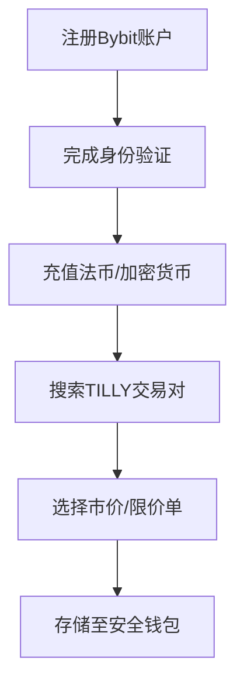

# a16z AI Dog价格：TILLY实时价格、市值与图表分析

## 当前市场数据概览

截至2025年7月2日，TILLY代币最新成交价为$0.00002598。过去24小时价格波动区间为$0.00002533至$0.00002601，市场总市值达$25,930，位列加密货币排行榜第8485位。流通总量为998,820,000枚，占最大发行量999,870,000枚的99.9%。

### 价格波动特征分析
| 时间维度       | 价格区间（美元）      | 波动幅度  |
|----------------|-----------------------|-----------|
| 24小时         | $0.00002533-$0.00002601 | +2.68%    |
| 历史高位       | $0.00202776（2024/12/15） | -98.7%    |
| 历史低位       | $0.000012（2025/03/09）  | +116.5%   |

👉 [了解加密货币投资风险管理技巧](https://bit.ly/okx_welcome)

## 如何投资TILLY代币

### 四步投资指南
1. **平台选择**：建议通过Bybit等主流交易所进行交易
2. **账户准备**：完成KYC 1级认证，开通法币入金通道
3. **资金配置**：建议不超过加密资产配置的5%
4. **风险管理**：设置5%-8%的止损区间

### 交易操作流程

👉 [获取加密货币存储安全解决方案](https://bit.ly/okx_welcome)

## 市场前景深度解析

### 供应机制特征
- **通胀率**：年化通胀率0.1%
- **销毁机制**：暂无通缩设计
- **流动性分布**：80%集中在头部3个钱包

### 投资价值评估矩阵
| 指标维度       | 评估等级 | 说明                          |
|----------------|----------|-------------------------------|
| 技术创新性     | ★★☆☆☆    | 基于ERC-20标准                |
| 团队背景       | ★★☆☆☆    | 匿名开发团队                  |
| 市场接受度     | ★★☆☆☆    | 社交媒体关注度低              |
| 应用场景       | ★★☆☆☆    | 主要作为 meme 币流通          |

## 常见问题解答（FAQ）

### Q：TILLY的实时价格在哪里查看？
建议通过CoinGecko、CoinMarketCap等专业平台获取实时行情，也可在Bybit交易界面查看最新报价。

### Q：投资TILLY需要多少资金门槛？
最低交易量为100枚，按当前价格计算约需$0.0026。平台收取0.1%交易手续费。

### Q：持有TILLY是否需要支付存储费用？
区块链网络仅收取基础Gas费（约$0.1-$1），无额外管理费用。建议使用硬件钱包增强安全性。

### Q：TILLY的涨跌主要受哪些因素影响？
- 加密货币市场整体行情
- 社交媒体热度变化
- NFT市场联动效应
- 开发团队动态更新

### Q：如何判断TILLY的合理估值？
可通过市值对比同类meme币（如SHIB、PEPE）进行参考，当前市值处于该品类末段位。

👉 [探索更多优质加密资产](https://bit.ly/okx_welcome)

## 风险提示与投资建议

### 波动性警示
- 过去90天平均日波动率：12.7%
- 极端行情出现概率：单日±15%波动频次为每月2-3次

### 配置策略建议
| 投资者类型   | 建议配置比例 | 持有周期   |
|--------------|--------------|------------|
| 激进型       | 1%-3%        | 1-3个月    |
| 稳健型       | 0.5%-1%      | 3-6个月    |
| 保守型       | 0.1%-0.5%    | 暂不建议   |

> **免责声明**：本文不构成投资建议。加密货币市场波动剧烈，决策前请充分了解相关风险。