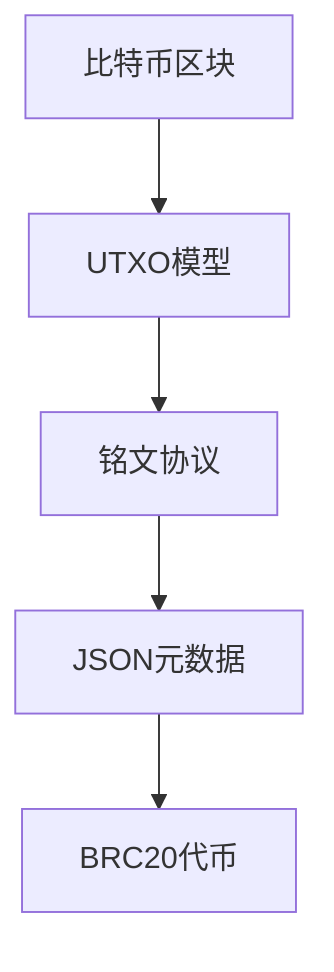

# 一站式比特币钱包解决方案：BRC20与BTC资产管理指南

随着区块链技术的持续发展，数字资产管理需求呈现指数级增长。本文将系统解析新一代比特币钱包的核心功能与应用场景，为区块链爱好者提供专业级的资产配置方案。

## 比特币钱包核心功能解析

### 资产管理矩阵
现代数字钱包已突破基础存储功能，Bitget Wallet构建了包含多链适配、智能兑换、DApp生态的立体化服务体系。支持BTC/BRC20/USDT等多种资产跨链管理，用户可实现：
- 主流公链资产跨链桥接
- 实时市场数据追踪
- 链上行为可视化分析
- 多维度资产配置管理

### 智能兑换系统
基于Bitget Swap的智能路由引擎，集成全球主流交易对深度：
| 交易对类型 | 支持币种 | 流动性池规模 |
|------------|----------|--------------|
| BTC本位交易 | ORDI/SATS/RATS等 | $2.1亿 |
| 法币通道 | USD/CNY/EUR | 实时汇率对接 |
| 稳定币兑换 | USDT/USDC | 零滑点机制 |

## 钱包创建全流程指南

### 四步构建数字资产门户
1. **账户初始化**
   通过助记词生成或现有钱包导入，采用BIP39标准加密算法确保安全性
2. **主网配置**
   在主网管理界面选择Bitcoin网络，系统自动适配BTC/BRC20双链协议
3. **资产可视化**
   主页实时显示：
   - BTC余额与价值波动曲线
   - BRC20代币持仓矩阵
   - 交易历史时间轴
4. **OTC通道激活**
   👉 [即刻开通法币入金通道](https://bit.ly/okx_welcome)，支持0.1 BTC起投的阶梯费率体系

## BRC20生态深度解析

### 技术架构创新
该协议通过Ordinal理论实现数据铭刻，构建了独特的资产发行体系：

### 应用场景拓展
- **数字收藏品**：ORID/SATS等稀缺资产确权
- **链上金融**：TURT/RATS的流动性挖矿
- **价值存储**：Taproot升级后的智能合约部署

## 闪电网络效能优化

### 二层扩展方案优势
| 指标 | 主链交易 | 闪电网络 |
|------|----------|----------|
| 确认时间 | 10分钟 | 实时 |
| 手续费 | $1.2 | $0.0001 |
| 吞吐量 | 7 TPS | 100万 TPS |

通过建立双向支付通道，实现：
- 瞬时结算的高频微支付
- 隐私增强的洋葱路由协议
- 链下合约的状态通道管理

## 技术演进里程碑

### Taproot升级深度解析
2021年11月激活的协议升级带来：
- **签名聚合**：Schnorr算法将多签交易压缩80%
- **隐私增强**：复杂合约与普通交易呈现同质化特征
- **智能合约进化**：支持Merkleized Abstract Syntax Trees（MAST）结构

### 量子安全预演
钱包系统已预置抗量子攻击模块，采用CRYSTALS-Kyber算法构建防御体系。

## 行业应用场景

### 企业级解决方案
- **跨境支付**：某跨境电商平台通过闪电网络实现日均百万笔交易
- **供应链金融**：基于BRC20的贸易融资凭证发行
- **数字身份**：Taproot地址的KYC/AML合规认证体系

### 个人使用场景
- **资产多元化**：BTC主资产+ORID收藏品的组合配置
- **收益优化**：通过Swap实现年化5-15%的流动性挖矿收益
- **即时支付**：咖啡店闪电网络支付的0.5秒结算实践

## 常见问题解答

### 资产安全篇
**Q: 私钥丢失如何恢复？**  
A: 系统生成的12/24字助记词可完全恢复钱包，建议采用金属备份+多重加密存储方案

**Q: 如何防范钓鱼攻击？**  
A: 启用生物识别+硬件安全模块（HSM），定期更新账户安全策略

### 技术操作篇
**Q: BRC20转账需要多少手续费？**  
A: 当前网络拥堵时约0.0001 BTC，非高峰时段可降至0.00001 BTC

**Q: 如何查看交易确认状态？**  
A: 通过区块浏览器实时追踪，主网确认数≥3即为安全交易

### 生态发展篇
**Q: BRC20与EVM链的兼容性如何？**  
A: 通过跨链桥实现资产映射，Bitget Wallet已支持与以太坊的双向转换

**Q: 未来升级路线图？**  
A: 计划集成zkSTARKs零知识证明技术，提升交易吞吐量至百万级TPS

👉 [立即体验全球领先的加密货币兑换平台](https://bit.ly/okx_welcome)，获取BTC/BRC20资产管理专家服务

## 风险管理框架

### 多层防护体系
- **设备级**：TEE可信执行环境隔离
- **传输层**：TLS 1.3加密通道
- **数据层**：AES-256静态数据加密
- **审计机制**：独立第三方年度安全审计

### 反洗钱合规
系统集成链上分析引擎，实时监控：
- 大额交易预警
- 地址风险评分
- OFAC制裁名单匹配

## 市场趋势研判

2024年Q1数据显示：
- BRC20代币市值突破$30亿
- 比特币Layer2日均交易量增长217%
- Taproot地址占比达68.4%

建议投资者关注：
1. 铭文铸造平台的Gas费波动规律
2. 闪电网络节点激励计划
3. Taproot智能合约的DeFi应用创新

👉 [获取最新市场分析报告](https://bit.ly/okx_welcome)，把握区块链行业脉搏

通过本指南的系统解析，用户可全面掌握比特币钱包的使用精髓，在保障资产安全的同时，充分挖掘BRC20生态的增值潜力。建议定期关注官方技术更新，以应对快速演变的区块链技术格局。