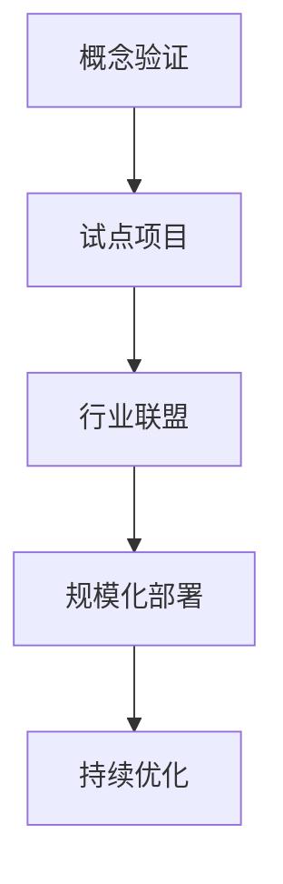

# 什么是区块链3.0？定义与核心价值

区块链3.0是区块链技术演进的最新阶段，其核心在于将去中心化技术深度整合到金融以外的行业领域，通过数据管理优化和技术创新推动产业变革。本文将从技术演进、应用场景、关键技术突破三个维度解析这一前沿概念。

## 区块链技术发展脉络

### 第一代：数字货币革命（2009-2013）
以比特币为代表，实现了点对点电子现金系统的突破，解决了双重支付问题。其工作量证明（PoW）机制确保交易安全性，但每秒仅处理7笔交易的性能限制了广泛应用。

### 第二代：智能合约时代（2014-2017）
以太坊引入图灵完备的智能合约，使区块链成为可编程的价值交换平台。去中心化应用程序（dApp）生态初现，但网络拥堵和高昂Gas费问题凸显。

### 第三代：产业融合阶段（2018-至今）
突破性技术特征包括：
- 多层级共识机制（如PoS+DPoS）
- 跨链互操作协议（如Polkadot的平行链设计）
- 零知识证明（ZKP）隐私保护方案
- 分片技术（如以太坊2.0的64分片架构）

👉 [探索区块链3.0技术应用案例](https://bit.ly/okx_welcome)

## 行业应用场景全景图

### 医疗健康领域
通过区块链的不可篡改特性，实现患者医疗记录的全生命周期管理。典型案例包括：
- 美国FDA与IBM合作的医疗数据共享平台
- 爱沙尼亚全民电子健康档案系统
- 新加坡NLP Labs药物溯源项目

| 解决方案         | 技术优势                 | 应用效果               |
|------------------|--------------------------|------------------------|
| 电子病历存证     | 数据防篡改               | 降低医疗纠纷率32%      |
| 药品供应链追踪   | 全流程透明可查           | 杜绝假药流通           |
| 基因数据共享     | 零知识证明隐私保护       | 促进精准医疗研究       |

### 智慧物流体系
马士基与IBM合作的TradeLens平台，通过区块链实现：
- 跨境单证处理时间从7天缩短至1天
- 货物追踪准确率提升至99.8%
- 海运成本降低20-30%

### 数字政务革新
韩国首尔市"我的首尔"平台：
- 电子投票系统确保选举透明度
- 公民数据自主管理权增强
- 政府服务响应效率提升40%

## 技术突破与创新方向

### 扩展性解决方案
1. **分层架构设计**
   - 第一层：基础链确保安全性
   - 第二层：状态通道实现高频交易
   - 第三层：应用层定制化开发

2. **共识机制革新**
   - 权益证明（PoS）降低能耗99.95%
   - 拜占庭容错（BFT）提升共识效率
   - 随机验证者选择（如Algorand）增强安全性

### 隐私保护技术
- 同态加密：在加密数据上直接运算
- 环签名：实现交易不可追踪
- 可验证凭证：数字身份自主控制

👉 [了解区块链隐私保护最新进展](https://bit.ly/okx_welcome)

## 发展挑战与应对策略

### 三大核心挑战
1. **监管合规**：全球32个国家已建立沙盒监管机制
2. **技术标准**：ISO/TC 307制定28项国际标准
3. **跨链互通**：Cosmos与Polkadot生态竞争加剧

### 企业落地路径

## 常见问题解答

**Q：区块链3.0与前两代的核心区别是什么？**  
A：核心差异在于应用场景的拓展，从金融基础设施（1.0）到可编程经济（2.0），最终实现产业深度融合（3.0）。技术层面主要体现在跨链互操作性和企业级解决方案的成熟度。

**Q：如何解决区块链的扩展性瓶颈？**  
A：目前主流方案包括：
- 分片技术（如以太坊2.0）
- 二层网络（如闪电网络）
- 有向无环图（DAG）结构
- 新型共识算法（如PoSt时空证明）

**Q：区块链3.0项目如何确保数据隐私？**  
A：综合运用零知识证明（ZKP）、同态加密、多方安全计算等技术。例如Zcash的Shielded Transactions可实现完全匿名交易，而Hyperledger Fabric的通道技术提供细粒度的隐私控制。

**Q：哪些行业将率先实现区块链3.0落地？**  
A：根据Gartner预测：
1. 供应链金融（2024年市场规模达$12.8T）
2. 数字身份认证（年增长率62%）
3. 碳排放交易（欧盟ETS已试点区块链系统）
4. 数字版权管理（NFT市场持续增长）

**Q：区块链3.0发展的最大阻力是什么？**  
A：当前主要面临三大阻力：
- 政策法规滞后（全球仅18%国家有明确监管框架）
- 技术成熟度不足（TPS超过1000的项目不足5%）
- 商业模式创新（传统企业转型意愿不足）

## 未来发展趋势

### 技术融合创新
- **AI+区块链**：机器学习优化共识算法，区块链保障数据可信
- **IoT+区块链**：设备数据自动上链，构建可信物联网生态
- **量子计算防御**：研发抗量子加密算法（如格密码学）

### 产业变革预测
到2025年：
- 60%跨国企业将采用混合区块链架构
- 45%政府服务将实现区块链化
- 去中心化身份（DID）用户突破5亿

👉 [把握区块链3.0投资机遇](https://bit.ly/okx_welcome)

区块链3.0正在重塑数字时代的信任基础设施。通过技术创新与产业融合，其价值将不仅体现在金融领域，更将深刻影响医疗、物流、政务等实体经济的运行模式。对于企业而言，构建跨行业协作生态和培养复合型技术人才，将成为把握这一历史性机遇的关键。