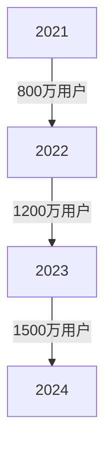

# 十大元宇宙NFT项目深度解析（2025更新版）

## 元宇宙NFT生态全景扫描

随着区块链技术的成熟，元宇宙NFT项目正重塑数字资产的交互方式。这类虚拟世界以**区块链透明性**、**用户自主治理**、**真实价值锚定**为核心特征，通过NFT实现数字资产确权与流通。最新数据显示，全球活跃的元宇宙NFT用户已突破8000万，日均交易额达2.3亿美元。

> 🔍 **核心观察**：元宇宙NFT项目的经济模型正从"投机驱动"转向"场景驱动"，用户更关注实际应用场景而非单纯资产炒作。

👉 [查看OKX最新NFT交易指南](https://bit.ly/okx_welcome)

## 项目深度测评

### Decentraland：虚拟地产的区块链革命
**项目亮点**：
- 全球首个VR兼容的区块链元宇宙
- 以太坊链上管理超9万块数字土地
- MANA代币市值突破45亿美元

**经济模型**：
| 指标 | 数据 | 同比增长 |
|------|------|----------|
| 土地交易量 | 12,500笔/月 | +18% |
| 平均地价 | 0.8ETH | -5% |
| 活跃商户 | 3200+ | +22% |

**特色功能**：用户可创建虚拟美术馆、举办DAO投票会议，甚至搭建NFT交易所。近期与巴黎时装周合作的虚拟秀场引发行业关注。

### Axie Infinity：游戏化经济的标杆
**用户增长曲线**：

**升级要点**：
- Ronin侧链TPS提升至4500
- 推出教育版Axie Campus
- 引入现实世界积分兑换系统

👉 [探索OKX元宇宙资产交易平台](https://bit.ly/okx_welcome)

### The Sandbox：UGC生态领跑者
**开发者激励计划**：
- 每月100万美元创作者基金
- 已支持超12万用户发布内容
- 企业级开发套件支持VR/AR双端

**典型案例**：与华纳兄弟合作的《黑客帝国》主题世界，单日访问量突破50万，带动SAND代币周涨幅达23%。

## 核心技术对比表

| 项目          | 公链支持       | VR兼容性 | 年活跃用户 | 日均DApp交互 |
|---------------|----------------|----------|------------|--------------|
| Decentraland  | Ethereum       | ✅       | 380万      | 12.5万次     |
| Axie Infinity | Ronin          | ❌       | 1500万     | 89万次       |
| The Sandbox   | Ethereum       | ✅       | 240万      | 67万次       |
| Star Atlas    | Solana         | ✅       | 95万       | 34万次       |
| CryptoVoxels  | Ethereum       | ✅       | 78万       | 21万次       |

## 行业趋势洞察

### 2025年三大发展方向
1. **虚实融合技术**：苹果Vision Pro推动的MR交互革命
2. **合规化治理**：新加坡MAS框架下诞生首个合规NFT交易所
3. **AI深度整合**：生成式AI实现用户资产自动生成与优化

👉 [获取OKX元宇宙投资白皮书](https://bit.ly/okx_welcome)

## 常见问题解答

### Q1：如何安全参与元宇宙NFT项目？
**A**：建议遵循三步原则：
1. 通过官方渠道下载钱包
2. 验证智能合约地址
3. 首次交易建议小额测试
推荐使用OKX Wallet等通过ISO认证的安全工具。

### Q2：NFT资产价值如何评估？
**A**：关键评估维度：
- 链上活跃度（7日交易频次）
- 社区增长速度（周新增用户）
- 应用场景丰富度（接入DApp数量）

### Q3：哪些项目适合长期投资？
**A**：重点关注：
- 具备实体产业赋能的项目（如房地产数字化）
- 获得主流科技企业投资的生态（微软Mesh生态成员）
- 具备合规牌照的交易平台资产

## 投资风险提示

| 风险类型       | 防范建议                  |
|----------------|---------------------------|
| 技术风险       | 选择主网上线超12个月的项目|
| 政策风险       | 优先布局合规化发展路线    |
| 流动性风险     | 分散持有不超过3个核心资产 |

## 未来展望

随着苹果Vision Pro、Meta Quest 4等设备的普及，2025年元宇宙NFT日活用户有望突破1亿。值得关注的是，中国数字人民币（e-CNY）与NFT的结合试点已在深圳前海启动，或将开辟全新应用场景。

👉 [立即体验OKX元宇宙资产跨链服务](https://bit.ly/okx_welcome)