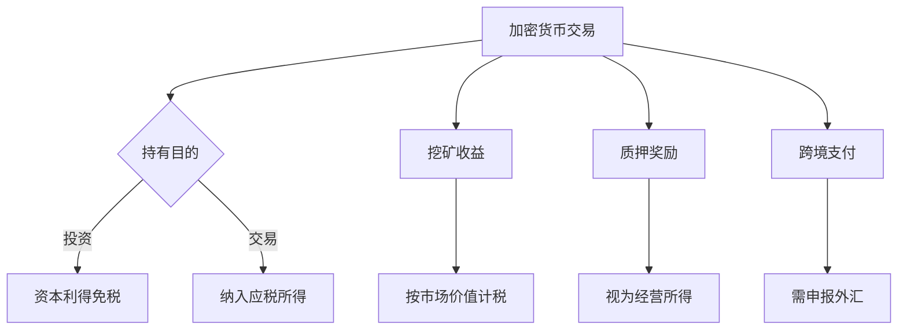

# 新西兰加密货币税收政策全景解析

## 新西兰加密货币发展现状

### 投资热度持续升温
新西兰作为南半球金融创新先锋，加密货币投资热潮方兴未艾。最新数据显示：
- **50%**人口接触加密资产（持有/计划投资）
- **9.5%**投资者持有加密投资产品（2024年数据）
- **年增长率**达210%（2023-2024）

👉 [探索全球加密投资新机遇](https://bit.ly/okx_welcome)

**投资趋势洞察表**
| 投资阶段       | 占比   | 同比变化 |
|----------------|--------|----------|
| 已持有         | 38%    | ↑12%     |
| 计划投资       | 12%    | ↑8%      |
| 持观望态度     | 50%    | ↓20%     |

### 监管框架渐趋完善
由新西兰储备银行(RBNZ)与金融市场管理局(FMA)双轨监管：
1. **RBNZ**：监测系统性金融风险
2. **FMA**：发放交易所牌照并持续监管
3. **创新监管工具**：ICO合规指南、资产分类标准

#### 监管里程碑
- 2022年：加密交易所强制注册制度
- 2023年：反洗钱合规升级
- 2024年：引入实时交易监控系统

## 税制体系基础架构

### 税收架构三维模型
```markdown
1. 核心税种
   - 企业所得税 28%
   - 个人所得税 10.5-39%
   - 商品服务税 15%

2. 特殊税种
   - 附加福利税 49.25-63.93%
   - 雇主社保附加税 10.5-39%
   - 消费税（特定商品）

3. 取消税种
   - 赠与税（2011年后取消）
   - 资本利得税（长期持有免税）
```

### 税收征管特点
- **属地原则**：非居民仅就新西兰境内所得纳税
- **全球征税**：居民纳税人需申报全球收入
- **数字化申报**：95%税务通过线上系统处理

## 加密资产税务处理细则

### 应税场景全景图


### 税率对照表
| 收入类型       | 税率区间    | 特殊说明               |
|----------------|-------------|------------------------|
| 短期交易收益   | 10.5-39%    | 按个人/企业所得税计缴  |
| 质押奖励       | 15-39%      | 视同经营所得           |
| 赠与行为       | 0-25%       | 2011年前赠与适用       |
| 跨境交易       | 15% GST     | 商户需代扣代缴         |

#### 税务合规要点
- **记录保存**：需留存交易凭证至少7年
- **估值标准**：采用交易当日市场公允价值
- **申报义务**：单笔超$10,000需特别申报
- **损失抵扣**：仅限交易型持有者使用

### 税收优惠政策矩阵
| 政策类型           | 适用条件                     | 节税效果               |
|--------------------|------------------------------|------------------------|
| 过渡税务居民       | 新移民且海外收入未汇回       | 4年海外收入免税        |
| 小微企业优惠       | 年营业额<200万纽元           | 税率降低3-5个百分点    |
| 损失结转           | 投资亏损可抵扣其他收入       | 最多抵扣5年            |
| 研发抵扣           | 区块链技术研发支出           | 150%加计扣除           |

👉 [解锁税收优化策略](https://bit.ly/okx_welcome)

## 常见问题解答

**Q：持有比特币超过1年出售是否免税？**  
A：是的，新西兰对长期持有（非交易目的）的加密资产免征资本利得税。

**Q：如何计算挖矿收益的应纳税额？**  
A：按挖矿当日加密货币市场价计入应税所得，适用个人所得税累进税率。

**Q：跨境加密支付是否需要申报？**  
A：是的，单笔超$10,000纽元需向新西兰税务局申报资金来源。

**Q：NFT交易涉及哪些税种？**  
A：主要涉及商品服务税（15%）和个人所得税，艺术品类NFT可能适用特殊规定。

**Q：如何享受小微企税收优惠？**  
A：需注册为区块链服务企业，年营业额低于200万纽元，合规申报加密业务明细。

## 未来监管展望

新西兰联储于2024年4月启动CBDC公众咨询，标志着数字货币监管进入新阶段。监管框架将呈现三大趋势：
1. **双轨制监管**：CBDC与私人加密货币分道扬镳
2. **智能合约征税**：探索自动扣税技术方案
3. **跨境协作**：与OECD共同制定加密资产征管标准

👉 [把握数字金融发展先机](https://bit.ly/okx_welcome)
